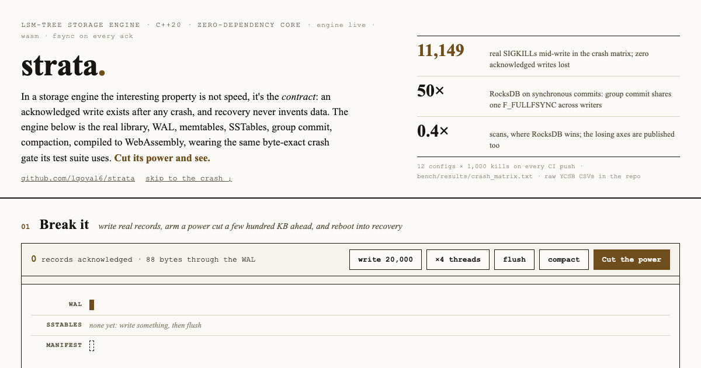

<a href="https://lgoyal6.github.io/strata/">
  
</a>

**[Open the live demo](https://lgoyal6.github.io/strata/)** - The
real engine compiled to WebAssembly: write to it, cut its power mid-write, and
watch recovery bring back every acknowledged byte.

# strata

A leveled LSM-tree key-value store in C++20 with **provable crash
durability**: write-ahead log, skiplist memtables, prefix-compressed
SSTables with Bloom filters, size-tiered L0 + leveled compaction with write
backpressure, MVCC snapshots - and a crash harness that SIGKILLs the engine
at randomized byte offsets inside its own `write(2)` calls and proves that
no acknowledged write is ever lost and no torn record is ever accepted.


A thousand iterations of the crash harness, most of them ending in a real
SIGKILL at a random byte offset inside the engine's own `write(2)`, with every
acknowledged write recovered afterwards. Reproduce it with
`./docs/demo-setup.sh && vhs docs/demo.tape`. Note the honest scope: this kills
the process, not the machine, so it verifies the engine's contract rather than
the drive's.

> **Thesis.** In a storage engine the interesting property is not speed,
> it's the *contract*: an acknowledged write exists after any crash, and
> recovery never invents data. strata makes that contract mechanically
> checkable - every byte on disk is either CRC-guarded or reconstructible,
> and the whole recovery surface (WAL, SSTable, MANIFEST parsers) is
> fuzzed and crash-swept. Both sides of every benchmark trade get
> published; a table where strata beat RocksDB at everything would mean
> the benchmark is broken.

## The crash matrix

12 configurations × 1,000 iterations (`tools/crash_test`); CI reruns the same
12 configurations at 850 iterations each on every push, for 10,200 kill points
a commit. Each iteration forks a child workload, kills it with
a real `SIGKILL` - either at a random **byte offset inside a write(2)**
(deterministic torn writes via the Env fault-injection choke point) or at
a random **wall-clock instant** - then reopens the database and asserts:
(a) every acknowledged op survives with the correct value, (b) every
recovered value passes its embedded checksum, (c) the recovered state
equals the model at *exactly* the acknowledged prefix (± the single
in-flight op). `chain` mode keeps crashing and re-recovering the same
directory, so kills land inside recovery, flush, and compaction of real
state.

| mode | kill | fsync | iterations | real SIGKILLs | acked writes verified | failures |
|---|---|---|---:|---:|---:|---:|
| fresh | byte-offset | always   | 1000 | 871 | 95,821 | **0** |
| fresh | byte-offset | interval | 1000 | 852 | 100,128 | **0** |
| fresh | byte-offset | never    | 1000 | 860 | 100,443 | **0** |
| fresh | timer       | always   | 1000 | 983 | 186,610 | **0** |
| fresh | timer       | interval | 1000 | 919 | 345,111 | **0** |
| fresh | timer       | never    | 1000 | 911 | 357,666 | **0** |
| chain | byte-offset | always   | 1000 | 974 | 48,749 | **0** |
| chain | byte-offset | interval | 1000 | 976 | 49,719 | **0** |
| chain | byte-offset | never    | 1000 | 976 | 49,589 | **0** |
| chain | timer       | always   | 1000 | 992 | 181,438 | **0** |
| chain | timer       | interval | 1000 | 918 | 351,790 | **0** |
| chain | timer       | never    | 1000 | 917 | 356,188 | **0** |
| **total** | | | **12,000** | **11,149** | **2,223,252** | **0** |

Raw output: [`bench/results/crash_matrix.txt`](bench/results/crash_matrix.txt).

Note what the matrix does and doesn't claim: `SIGKILL` preserves the OS
page cache, so **all three fsync policies** must show zero loss (the WAL is
`write(2)`-flushed before every ack) - and they do. Power-loss durability
is additionally claimed only for `fsync=always` (with `use_fullfsync` on
macOS to defeat the drive cache); SIGKILL cannot test that, so the matrix
doesn't pretend to.

### Bugs the harness actually caught

The matrix is not decoration - before it went green it found two real bugs
in this engine (see `docs/DESIGN.md` §1.3, §2.2):

1. **Torn-tail resurrection.** Crash tears the WAL tail → recovery stops at
   the tear and opens a new WAL → the torn bytes are now *mid-sequence* →
   the next crash's recovery cannot distinguish them from real corruption.
   Fix: recovery durably truncates the tear it stops at. Found by `chain`
   mode within 60 iterations.
2. **Interval-fsync buffer race.** The group-commit leader appends to the
   WAL with the DB mutex released; the background fsync tick could flush a
   half-appended buffer, leaving a CRC-invalid record mid-WAL. A
   one-in-thousands interleaving - found at kill point ~11,700 of 12,000.

## Architecture

```
              write(k,v)                       get(k) / scan
                  │                                 │
        ┌─────────▼──────────┐             ┌────────▼─────────┐
        │  writer queue      │             │ MVCC snapshot    │
        │  (group commit)    │             │ (seq pinning)    │
        └───┬──────────┬─────┘             └────────┬─────────┘
            │          │                            │
   ┌────────▼───┐  ┌───▼────────────┐      memtable → immutables
   │  WAL       │  │ memtable       │       → L0 (newest first)
   │  crc32c    │  │ (skiplist)     │       → L1..L6 binary search
   │  records   │  └───┬────────────┘       bloom → index → block
   └────────────┘      │ full: rotate (with WAL)
                  ┌────▼─────────┐    ┌──────────────────┐
                  │ flush thread │    │ compaction thread│
                  │ imm → L0 SST │    │ L0 tiered → L1+  │
                  └────┬─────────┘    │ leveled, cursor  │
                       │              └───────┬──────────┘
                  ┌────▼──────────────────────▼───┐
                  │ MANIFEST: full-snapshot +     │
                  │ atomic rename + dir fsync     │
                  └───────────────────────────────┘
```

- **WAL**: one checksummed record per atomically-committed batch; file
  header carries a per-database UUID; torn tails truncated at recovery.
  fsync policy `always` / `interval` / `never` - the durability matrix
  above is exactly this knob.
- **SSTables**: 4 KiB prefix-compressed blocks with restart points, per-block
  CRC32C, whole-file Bloom filter (10 bits/key), block index with shortest
  separators, fixed 56-byte footer. Proposed format: `docs/DESIGN.md` §1.1.
- **Compaction**: size-tiered L0 (all L0 files merge at once) + leveled
  L1..L6 with a round-robin cursor, boundary-key expansion (the LevelDB
  boundary bug), snapshot-aware GC, tombstones dropped only at the
  bottommost level. Writes **stall rather than OOM**: 1 ms slowdown at 8 L0
  files, hard stop at 12 or 2 immutable memtables.
- **MVCC**: sequence-tagged internal keys; snapshots pin a sequence;
  iterators are point-in-time; compaction never GCs a version a live
  snapshot can still see.
- **Durability ordering** (each step durable before the next): SST fsync →
  dir fsync → MANIFEST tmp fsync → atomic rename → dir fsync → only then
  delete WALs/SSTs. An acknowledged write is always in ≥1 durable place.

## Use it in your project

Both paths land on the same `strata::strata` target, so you can switch between
them without touching your code.

```cmake
include(FetchContent)
FetchContent_Declare(strata
    GIT_REPOSITORY https://github.com/lgoyal6/strata.git
    GIT_TAG        v0.1.0)
FetchContent_MakeAvailable(strata)

target_link_libraries(your_app PRIVATE strata::strata)
```

Or install it once and find it from anywhere:

```bash
cmake -S . -B build -DCMAKE_BUILD_TYPE=Release
cmake --build build --target strata
cmake --install build --prefix /usr/local
```

```cmake
find_package(strata 0.1 REQUIRED)
target_link_libraries(your_app PRIVATE strata::strata)
```

Pulled in as a subproject, strata builds the library and nothing else: the
crash harness, tools, fuzzers and the RocksDB benchmark all default off unless
strata is the top-level project, so your configure step never needs clang or a
RocksDB install.

```cpp
#include <strata/db.h>
#include <strata/options.h>

strata::Options opts;
opts.create_if_missing = true;
strata::DB* db = nullptr;
auto st = strata::DB::open(opts, "/tmp/mydb", &db);

st = db->put(strata::WriteOptions{}, "key", "value");
std::string out;
st = db->get(strata::ReadOptions{}, "key", &out);
delete db;
```

The durability contract is the reason to reach for this rather than a map on
disk. `Options::fsync_policy` defaults to `FsyncPolicy::kAlways`, which fsyncs
the WAL before every acknowledgement, and under that policy an acknowledged
`put` survives a `SIGKILL` at any byte offset inside the engine's own
`write(2)`. That is the property the crash matrix below measures. Relax it to
`kInterval` and you trade the guarantee for throughput, deliberately and
visibly.

A whole program rather than a fragment lives in
[`examples/eventlog`](examples/eventlog): a per-device event log that batches
appends, scans one device's time window back with a prefix bound, holds a
snapshot open across a concurrent write, and reopens the database to prove the
events are still there. It is deliberately **not** part of this build - it
configures on its own against an installed strata, because an in-tree
`add_subdirectory` would prove nothing about the package you actually ship. CI
runs exactly this sequence on every push, and the example exits nonzero if any
of its own invariants disagree:

```bash
cmake -S . -B build/inst -DCMAKE_BUILD_TYPE=Release
cmake --build build/inst --target strata
cmake --install build/inst --prefix /tmp/strata-prefix
cmake -S examples/eventlog -B /tmp/eventlog -DCMAKE_PREFIX_PATH=/tmp/strata-prefix
cmake --build /tmp/eventlog && /tmp/eventlog/eventlog /tmp/eventlog-db
```

```
wrote 6000 events (2000 ticks x 3 devices)
sensor-a: 2000 events total, 500 in the last window
snapshot sees 2000, current sees 2050 (expected 2000 and 2050)
after reopen: 2050 events
OK
```

`scripts/test-package-upgrade.sh` installs the tagged v0.1.0 package, builds and
runs a retained external consumer, upgrades the same prefix to v0.1.1, and runs
the consumer again. Its negative control requires an incompatible exact 0.2
package and must fail configuration. CI fetches release tags and runs this gate.

## Build & test

Needs CMake ≥ 3.24, Ninja, and a C++20 compiler reachable as `clang++`. The
presets name that generator and that compiler explicitly, so CMake will stop at
`CMAKE_MAKE_PROGRAM is not set` rather than silently falling back to make if
Ninja is missing. On macOS: `brew install cmake ninja` (Apple clang from the
Xcode command line tools is new enough). On Debian/Ubuntu:
`apt install cmake ninja-build clang`. Nothing else is fetched at configure
time except googletest, which CMake downloads itself.

```
cmake --preset release && cmake --build --preset release
ctest --preset release                    # 51 tests incl. model-based fuzzer
cmake --preset dev && ...                 # ASan/UBSan (Linux/CI)
cmake --preset dev-mac && ...             # ASan/UBSan via brew LLVM (macOS)
```

The highest-leverage test is `test/unit/db_model_test.cc`: 30k random ops
mirrored into a `std::map`, with full-scan/point-get/snapshot equivalence
checked continuously under 4 KiB write buffers (constant flush/compaction
churn) and periodic reopen-recovery. The suite also passes under
ThreadSanitizer (`-DSTRATA_SANITIZE=thread`).

## Crash harness

```
./build/release/tools/crash_test orchestrate \
    --dir /tmp/strata-crash --iters 1000 --workers 8 \
    --fsync always --mode chain --kill bytes --seed 42
```

`--kill bytes` sets `STRATA_CRASH_AT_BYTES=<n>`: the engine's Env counts
every byte handed to `write(2)` and the write crossing byte *n* is torn at
exactly that offset before the process `raise(SIGKILL)`s itself - a
deterministic torn write at an arbitrary byte position (WAL record, SSTable
block, MANIFEST - wherever the offset lands). A failing iteration prints its
exact parameters, and `crash_test repro --seed ... --ops ... --crash-at ...`
replays a byte-mode kill deterministically.

## Fuzzing

`fuzz/fuzz_wal.cc`, `fuzz_sstable.cc`, `fuzz_manifest.cc` - every parser on
the recovery path - run under libFuzzer + ASan/UBSan with
coverage-instrumented library code and corpora seeded from real files:

```
./fuzz/run_fuzz.sh wal 300
```

Byte-level robustness is also unit-tested directly: truncate-at-every-byte
(WAL, MANIFEST) and flip-every-byte (SSTable, MANIFEST) sweeps assert that
corruption is always detected, never silently accepted.

## Benchmarks vs RocksDB

YCSB core workloads, 1 M records × 100 B values, scrambled zipfian θ=0.99,
1 M ops (200 k for E), Apple M3 Pro / APFS. Matched knobs (compression off
in both, same buffers/cache/bloom/L0 triggers - full fairness table in
[`docs/BENCHMARKS.md`](docs/BENCHMARKS.md)); RocksDB 11.1.2. Raw output:
[`bench/results/ycsb.txt`](bench/results/ycsb.txt).

| workload | threads | strata ops/s | RocksDB ops/s | strata/RocksDB |
|---|---:|---:|---:|---:|
| load (1M inserts) | 1 | 439,851 | 361,354 | **1.22×** |
| A (50/50 r/w)     | 1 | 523,065 | 421,507 | **1.24×** |
| B (95/5)          | 1 | 778,132 | 597,128 | **1.30×** |
| C (read-only)     | 1 | 848,247 | 728,189 | **1.16×** |
| E (95% scans)     | 1 | 107,470 | 75,196  | **1.43×** |
| load              | 4 | 315,129 | 379,757 | **0.83×** |
| A                 | 4 | 448,657 | 654,504 | **0.69×** |
| B                 | 4 | 1,420,535 | 1,890,267 | 0.75× |
| C                 | 4 | 1,768,752 | 2,492,955 | **0.71×** |
| E                 | 4 | 286,636 | 264,579 | **1.08×** |

Every row above comes from one matrix run on one host (Apple M3 Pro, 18 GB, macOS 26.5.2,
APFS), so the rows are comparable with each other. Workload E percentiles are scan-only:
the harness reports each operation kind separately, because E is 95% scan / 5% insert and
a pooled percentile hides which one owns the tail.

**One row does not repeat: E at 4 threads.** Re-measuring that ratio on a 1 M-record
store gave 1.28× in strata's favour in one quiet window and 0.58×, against strata, in
another, with a 1.8× spread inside a single engine and configuration. The 1.08× above is
one run of the matrix, not a resolved number, and this machine cannot settle it. The
single-threaded rows are the stable ones. See [`docs/BENCHMARKS.md`](docs/BENCHMARKS.md) §6.

Write amplification on the identical load (each engine's own counters):
**strata 4.53×, RocksDB 4.66×** - the leveled-compaction cost model lands
where it should.

Synchronous commits (50 k inserts, 4 threads, WAL sync per commit,
`F_FULLFSYNC` in **both** engines - RocksDB always uses it for `sync=true`
on macOS):

| engine / mode | ops/s | p50 |
|---|---:|---:|
| strata, `fsync=always` + `use_fullfsync` | **1,015** | 3.5 ms |
| RocksDB, `sync=true` | 20 | 4.0 ms (p999 298 ms) |
| strata, `fsync=always` (plain `fsync`, weaker: kernel-ordered only) | 85,011 | 50 µs |

Group commit is doing exactly its job: at 3.5–4 ms per drive-cache flush,
throughput is set by how many commits share one flush.

**Where strata loses, and why** (the interview part  - 
[`docs/BENCHMARKS.md`](docs/BENCHMARKS.md) §7):

- **Every 4-thread workload except scans (0.69–0.83×).** strata's writer queue has a
  single leader doing WAL append + memtable apply; reads contend on one DB
  mutex for source capture. RocksDB pipelines WAL and memtable writes and
  spent a decade shaving its read hot path. strata's single-thread *wins*
  flip to losses exactly when concurrency enters - that's the design gap,
  not noise (strata's own 4-thread load is *slower* than its 1-thread load).
  Workload E is the apparent exception since the scan fix, at 1.08× in this
  matrix, but that particular ratio does not repeat on this host (see the
  caveat under the table) and should not be read as a win. The range above is
  the current matrix, not the pre-fix one.
- **Scans - fixed, and the original diagnosis was wrong.** These were
  0.43-0.47× with p95 169 µs vs 22 µs. The stated cause used to be eager
  cursor construction over every live file. Measuring it (opt-in counters,
  `-DSTRATA_SCAN_PROBE=ON`) showed that was not it: a scan has **4 children,
  one of them L0**, so construction is nearly free. The real cost was that a
  scan yielding ~50 rows did **522 internal advances, 471 of them stepping
  over superseded versions of keys already yielded** - one hot key had 4,077
  obsolete versions walked one at a time, each costing an N-way merge
  comparison. Zipfian updates pile versions on a small hot set and nothing
  reclaims them during a read-heavy phase, which is why only the tail broke:
  baseline p50 already matched RocksDB. `DBIter` now replaces a long version
  run with one targeted seek past the yielded key (threshold 16, swept 4-128).
  Per scan: advances 522 → 64, skipped versions 472 → 13, comparisons
  2,092 → 260. Scan p95 170 µs → **15.8 µs**, p99 186 µs → **19.2 µs**.
  The write-side cause is untouched: this bounds the read symptom, it does
  not make compaction reclaim versions sooner.
- **Read tails.** p99 on read-heavy workloads runs 1.1–2× RocksDB's
  (whole-file bloom vs partitioned filters; one shared LRU vs sharded,
  pinned cache handling).

## Design document

[`docs/DESIGN.md`](docs/DESIGN.md) - the on-disk formats (proposed before
any code was written), the recovery invariants, the compaction policy and
its write-amplification model, and the durability taxonomy (SIGKILL vs
power loss vs drive cache).

## Limitations (deliberate)

- Forward-only iterators (`Prev()` is absent, not half-implemented).
- No block compression (benchmarks run RocksDB with compression off for
  fairness; snappy/zstd is the obvious v2 item).
- Full-snapshot MANIFEST rewrite per version change - right at embedded
  scale, wrong at RocksDB scale (their log-structured VersionEdit is the
  scale-up path).
- Whole-file Bloom filters, no partitioned indexes, no column families, no
  transactions beyond the atomic `WriteBatch`.
- macOS `fsync` does not flush the drive cache; `Options::use_fullfsync`
  exists and is off by default, matching RocksDB - stated rather than
  hidden.

## License

MIT
